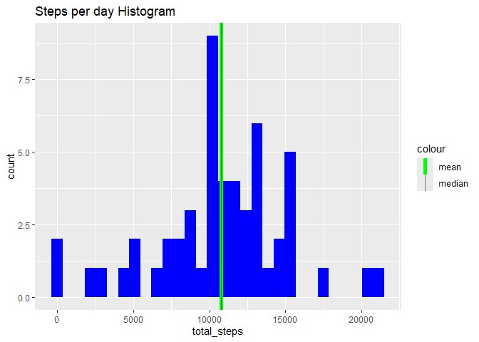
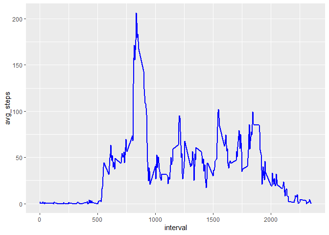
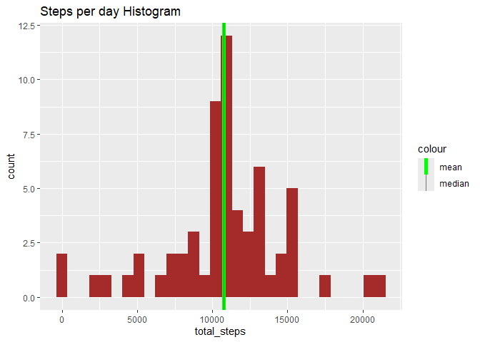

## Loading and preprocessing the data

``` r
data <- read.csv('activity.csv')
```


``` r
head(data)
```

```
##   steps       date interval
## 1    NA 2012-10-01        0
## 2    NA 2012-10-01        5
## 3    NA 2012-10-01       10
## 4    NA 2012-10-01       15
## 5    NA 2012-10-01       20
## 6    NA 2012-10-01       25
```

## What is mean total number of steps taken per day?
### Import data manipulation library

``` r
library(dplyr)
```

```
## Warning: package 'dplyr' was built under R version 4.5.2
```

```
## 
## Adjuntando el paquete: 'dplyr'
```

```
## The following objects are masked from 'package:stats':
## 
##     filter, lag
```

```
## The following objects are masked from 'package:base':
## 
##     intersect, setdiff, setequal, union
```

### Get average steps, total steps, and median for each day (ignoring the NA values)

``` r
proc_data <- data %>% filter(!is.na(steps)) %>%
    mutate(date = as.Date(date, "%Y-%m-%d")) %>% 
    group_by(date) %>% summarise(total_steps = sum(steps), avg_steps = mean(steps))

    
head(proc_data)
```

```
## # A tibble: 6 × 3
##   date       total_steps avg_steps
##   <date>           <int>     <dbl>
## 1 2012-10-02         126     0.438
## 2 2012-10-03       11352    39.4  
## 3 2012-10-04       12116    42.1  
## 4 2012-10-05       13294    46.2  
## 5 2012-10-06       15420    53.5  
## 6 2012-10-07       11015    38.2
```

### Import ggplot2 library for plots

``` r
library(ggplot2)
```

### Histogram of steps 

``` r
h <- ggplot(proc_data, aes(total_steps))
h + geom_histogram(fill = 'blue') + labs(title = "Steps per day Histogram") + 
    geom_vline(aes(xintercept = mean(total_steps), color = "mean"), size = 2) + 
    geom_vline(aes(xintercept = median(total_steps), color = "median"), alpha=0.5) +
    scale_color_manual(values = c("mean"="green", "median"="black")) #this map is added in order to get the legend 
```

```
## Warning: Using `size` aesthetic for lines was deprecated in ggplot2 3.4.0.
## ℹ Please use `linewidth` instead.
## This warning is displayed once per session.
## Call `lifecycle::last_lifecycle_warnings()` to see where this warning was
## generated.
```

```
## `stat_bin()` using `bins = 30`. Pick better value with `binwidth`.
```

<!-- -->
### Average and median total steps per day

``` r
print(paste("Mean total steps per day:", round(mean(proc_data$total_steps))))
```

```
## [1] "Mean total steps per day: 10766"
```

``` r
print(paste("Median total steps per day:", round(median(proc_data$total_steps))))
```

```
## [1] "Median total steps per day: 10765"
```
## What is the average daily activity pattern?

``` r
daily_pattern <- data %>% filter(!is.na(steps)) %>%
    mutate(date = as.Date(date, "%Y-%m-%d")) %>% 
    group_by(interval) %>% summarise(avg_steps = mean(steps))

head(daily_pattern)
```

```
## # A tibble: 6 × 2
##   interval avg_steps
##      <int>     <dbl>
## 1        0    1.72  
## 2        5    0.340 
## 3       10    0.132 
## 4       15    0.151 
## 5       20    0.0755
## 6       25    2.09
```

``` r
g <- ggplot(daily_pattern, aes(x = interval, y = avg_steps))
g + geom_line(color = 'blue', size = 1)
```

<!-- -->

``` r
print(daily_pattern[daily_pattern$avg_steps == max(daily_pattern$avg_steps),])
```

```
## # A tibble: 1 × 2
##   interval avg_steps
##      <int>     <dbl>
## 1      835      206.
```
## Imputing missing values
### Report the number of missing values

``` r
nas <- sum(is.na(data$steps))
print(paste("The number of NA values in the steps column is:", nas))
```

```
## [1] "The number of NA values in the steps column is: 2304"
```

### Filling missing values using the mean value for the corresponding interval

``` r
filled_data <- data %>% left_join(daily_pattern, by = "interval") %>%
    mutate(steps = if_else(is.na(steps), avg_steps , steps)) %>%
    select(steps, date, interval)

head(filled_data)
```

```
##       steps       date interval
## 1 1.7169811 2012-10-01        0
## 2 0.3396226 2012-10-01        5
## 3 0.1320755 2012-10-01       10
## 4 0.1509434 2012-10-01       15
## 5 0.0754717 2012-10-01       20
## 6 2.0943396 2012-10-01       25
```
### Histogram of steps (wona = without NAs)

``` r
data_wona <- filled_data %>%
    mutate(date = as.Date(date, "%Y-%m-%d")) %>% 
    group_by(date) %>% summarise(total_steps = sum(steps))

head(data_wona)
```

```
## # A tibble: 6 × 2
##   date       total_steps
##   <date>           <dbl>
## 1 2012-10-01      10766.
## 2 2012-10-02        126 
## 3 2012-10-03      11352 
## 4 2012-10-04      12116 
## 5 2012-10-05      13294 
## 6 2012-10-06      15420
```


``` r
h_wona <- ggplot(data_wona, aes(total_steps))
h_wona + geom_histogram(fill = 'brown') + labs(title = "Steps per day Histogram") + 
    geom_vline(aes(xintercept = mean(total_steps), color = "mean"), size = 2) + 
    geom_vline(aes(xintercept = median(total_steps), color = "median"), alpha=0.5) +
    scale_color_manual(values = c("mean"="green", "median"="black")) #this map is added in order to get the legend 
```

```
## `stat_bin()` using `bins = 30`. Pick better value with `binwidth`.
```

<!-- -->
### Average and median total steps per day (without NAs)

``` r
print(paste("Mean total steps per day:", round(mean(data_wona$total_steps))))
```

```
## [1] "Mean total steps per day: 10766"
```

``` r
print(paste("Median total steps per day:", round(median(data_wona$total_steps))))
```

```
## [1] "Median total steps per day: 10766"
```
### There is apreciable change in mean nor median nor in the histogram

## Are there differences in activity patterns between weekdays and weekends?
